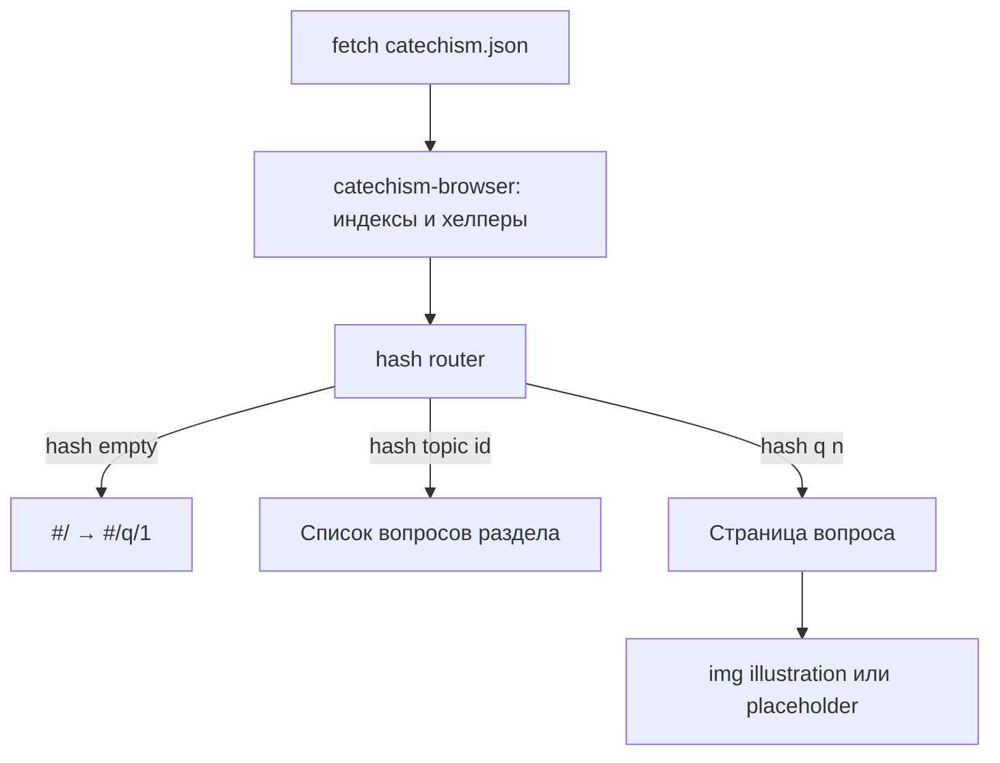

# Спецификация статического прототипа катехизиса

Спецификация однофайлового HTML-прототипа: каждая «страница» показывает материал по одному вопросу катехизиса. Данные — из [`data/catechism.json`](../data/catechism.json); подходы к рендеру — из [`utils/catechism.ts`](../utils/catechism.ts).

**Статус:** реализовано и принято (см. §10).

Связанные документы:

- [`svg-prompts-ts-spec.md`](svg-prompts-ts-spec.md) — требования к массиву промптов для SVG
- [`implementation-checklist.md`](implementation-checklist.md) — порядок реализации
- [`specs/svg-illustration-spec.md`](../specs/svg-illustration-spec.md) — генерация иллюстраций

---

## 1. Цель и границы

### Цель

Статический SPA-прототип для просмотра 114 вопросов катехизиса с разделами, стихами и иллюстрациями. Mobile-first, визуальный язык Material Design через Tailwind CSS v4 и CSS variables.

### Границы

| Входит | Не входит |
|--------|-----------|
| Один `index.html`, отдельные CSS и JS | Next.js / Astro / SSR |
| Fetch JSON в браузере | Zod-валидация на клиенте |
| Hash-роутинг между «страницами» | Отдельный HTML на каждый вопрос |
| Fallback на `_placeholder.svg` | Node `resolveIllustration` в клиенте |
| Material-подобные компоненты на Tailwind | Готовый UI-kit (MUI React и т.п.) |

Прототип открывается через локальный static server (нужен `fetch` JSON). Поддержка `file://` не требуется.

---

## 2. Целевая файловая структура

```
prototype_indoctrine/
├── index.html                 # вся HTML-разметка (shell)
├── styles/
│   ├── input.css              # источник: @import "tailwindcss" + @theme
│   └── app.css                # собранный CSS (артефакт сборки)
├── js/
│   ├── catechism-browser.js   # порт хелперов из utils/catechism.ts
│   └── app.js                 # роутинг, меню, рендер
├── data/
│   └── catechism.json         # source of truth (уже есть)
├── public/
│   └── illustrations/         # q001.svg … q114.svg (могут отсутствовать)
├── images/
│   └── _placeholder.svg       # fallback (уже есть)
├── package.json               # @tailwindcss/cli, скрипты
└── docs/                      # эта документация
```

Подключение в `index.html`:

```html
<link rel="stylesheet" href="styles/app.css" />
<script type="module" src="js/app.js"></script>
```

JS — ES modules. CSS и JS **не** инлайнить в HTML.

---

## 3. Архитектура SPA



### 3.1. Hash-роутинг

Нет отдельного маршрута-оглавления: полный список разделов и вопросов уже
доступен в Navigation Drawer (на mobile — по гамбургеру, на desktop — как
постоянная/сворачиваемая боковая панель), поэтому дублирующий экран со
списком 16 разделов не нужен.

| Маршрут | Содержимое |
|---------|------------|
| `#/` | Редирект на `#/q/1` (первый вопрос) |
| `#/topic/:id` | Вопросы раздела (`questionsForTopic`), сортировка по `question_number` |
| `#/q/:n` | Карточка вопроса `n` (1–114) |

Правила:

- Неизвестный или невалидный hash, а также сам `#/` → редирект на `#/q/1`.
- Номер вопроса вне 1…114 → редирект на `#/q/1`.
- Навигация меняет только hash; перезагрузки страницы нет.
- При `hashchange` и при старте (`DOMContentLoaded`) — один и тот же обработчик роутера.

### 3.2. HTML shell (`index.html`)

Вся разметка в одном файле. Обязательные регионы:

1. **Top App Bar** — название продукта, кнопка меню (mobile), опционально номер текущего вопроса.
2. **Navigation Drawer** — список разделов и вложенных вопросов.
3. **Overlay** — затемнение за drawer на mobile.
4. **Main** — контейнер `#app-main`, куда JS монтирует контент текущего маршрута.
5. **Templates** (опционально) — `<template id="…">` для карточки вопроса, пункта меню, блока стиха; либо чистый DOM через `createElement` / `innerHTML` с экранированием.

Тексты вопросов, ответов и стихов **не** хардкодить в HTML — только из JSON.

---

## 4. Mobile-first и адаптив

Базовые стили — для узкого экрана (≤640px). Расширение через breakpoints Tailwind:

| Breakpoint | Поведение |
|------------|-----------|
| default (`< md`) | Drawer скрыт (off-canvas); гамбургер виден; контент на всю ширину |
| `md` (≥768px) | Drawer постоянно открыт слева; гамбургер скрыт; overlay не используется |
| `lg` | Увеличенные отступы / max-width контента (~720–840px для текста вопроса) |

Принципы:

- Крупная типографика вопроса и ответа — читаемость на телефоне.
- Иллюстрация: ширина 100%, `aspect-ratio: 4 / 3`.
- Touch-цели меню ≥ 44×44px.
- Горизонтальный скролл страницы запрещён.

---

## 5. Визуальный язык: Material через Tailwind v4

Стилизация **без** React MUI: Material Design 3–подобные токены как CSS variables + утилиты Tailwind v4.

### 5.1. CSS variables и `@theme`

В `styles/input.css`:

```css
@import "tailwindcss";

@theme {
  --color-md-primary: var(--md-sys-color-primary);
  --color-md-on-primary: var(--md-sys-color-on-primary);
  --color-md-surface: var(--md-sys-color-surface);
  --color-md-on-surface: var(--md-sys-color-on-surface);
  --color-md-surface-container: var(--md-sys-color-surface-container);
  --color-md-outline: var(--md-sys-color-outline);
  --color-md-secondary: var(--md-sys-color-secondary);
  /* … остальные токены по необходимости */
  --font-sans: "Roboto", "Segoe UI", sans-serif;
  --radius-md: 12px;
  --radius-lg: 16px;
}

:root {
  /* Светлая спокойная палитра; согласовать с SVG-палитрой (#BFE3F0) */
  --md-sys-color-primary: #3d5a80;
  --md-sys-color-on-primary: #ffffff;
  --md-sys-color-secondary: #7fb4b0;
  --md-sys-color-surface: #f5fbfe;
  --md-sys-color-on-surface: #1a2332;
  --md-sys-color-surface-container: #ffffff;
  --md-sys-color-surface-tint: #bfe3f0;
  --md-sys-color-outline: #8a9bb0;
  --md-elevation-1: 0 1px 2px rgb(0 0 0 / 0.08), 0 1px 3px rgb(0 0 0 / 0.06);
  --md-elevation-2: 0 2px 6px rgb(0 0 0 / 0.10), 0 1px 4px rgb(0 0 0 / 0.06);
}
```

Запрещено для прототипа: фиолетово-индиговые «AI-дефолтные» градиенты, тёмная тема как база, glow-эффекты, emoji в UI.

**Общее требование — избегать «AI slop»:** прототип показывает 114 фиксированных вопросов, а не демонстрирует «навороченность». Не добавлять маркетинговый/приветственный текст, фейковую статистику, декоративные секции без данных из JSON, лишние конфигурируемые опции и абстракции сверх того, что требует спека (три маршрута, четыре массива данных), а также «AI-дефолтные» визуальные штампы (градиенты, glow, generic-иконки). Код и разметка — под конкретную задачу, без задела на гипотетическое будущее.

### 5.2. Компоненты (семантика Material)

| Компонент | Назначение |
|-----------|------------|
| Top App Bar | Фиксированная/sticky шапка, elevation-1 |
| Navigation Drawer | Навигация по topics → questions |
| List / List item | Пункты оглавления и drawer |
| Surface / Card | Блок вопроса (поверхность, без лишних карточек в «герое» — здесь card допустим как контейнер взаимодействия/чтения) |
| Typography | Вопрос (title), ответ (body large), стих (blockquote + cite) |
| Icon Button | Гамбургер, закрытие drawer |
| FAB / Text Button (опционально) | Prev / Next вопрос |

### 5.3. Сборка Tailwind v4

Минимальный toolchain:

```json
{
  "scripts": {
    "build:css": "tailwindcss -i ./styles/input.css -o ./styles/app.css",
    "watch:css": "tailwindcss -i ./styles/input.css -o ./styles/app.css --watch",
    "serve": "npx --yes serve ."
  },
  "devDependencies": {
    "@tailwindcss/cli": "^4",
    "tailwindcss": "^4"
  }
}
```

Источник — `styles/input.css`; в HTML подключается только `styles/app.css`.

---

## 6. Мобильное адаптивное меню

### 6.1. Поведение

1. На mobile кнопка-гамбургер в app bar открывает drawer слева.
2. Drawer содержит:
   - заголовок («Содержание» / название продукта);
   - список `topics` (accordion или вложенный список);
   - при раскрытии раздела — вопросы с номерами (`question_number`. `question_content`, текст можно усечь).
3. Клик по вопросу → `#/q/:n`, drawer закрывается (mobile).
4. Клик по разделу → `#/topic/:id` (и/или раскрытие списка без смены маршрута — на усмотрение реализации; минимум: переход на `#/topic/:id`).
5. Закрытие drawer:
   - кнопка «закрыть»;
   - клик по overlay;
   - клавиша Escape;
   - выбор пункта навигации (mobile).
6. На `md+` drawer всегда видим; overlay и гамбургер не активны.

### 6.2. Доступность (a11y)

Обязательные требования:

- Кнопка меню: `aria-expanded`, `aria-controls="nav-drawer"`, понятный `aria-label`.
- Drawer: `role="navigation"`, `id="nav-drawer"`, на mobile при открытии — `aria-modal="true"` (или аналог для dialog-паттерна).
- Focus: при открытии — фокус на первый фокусируемый элемент drawer или кнопку закрытия; при закрытии — возврат на кнопку меню.
- Focus trap внутри открытого mobile-drawer (Tab не уходит на main).
- Overlay: `aria-hidden="true"` (не в tab order).
- Текущий маршрут в меню: `aria-current="page"` на активном пункте.

### 6.3. Состояние в JS

```js
// псевдокод контракта
let drawerOpen = false;
function openDrawer() { /* classList, aria-expanded=true, trap focus */ }
function closeDrawer() { /* обратное, restore focus */ }
function toggleDrawer() { drawerOpen ? closeDrawer() : openDrawer(); }
```

При resize на `md+` — принудительно закрыть modal-состояние (убрать overlay, сбросить trap).

---

## 7. Данные и browser-порт хелперов

### 7.1. Загрузка

```js
const res = await fetch('data/catechism.json');
const catechism = await res.json();
// catechism.topics | questions | verses | question_verses
```

Клиентская Zod-валидация **не** обязательна для прототипа (схема уже в `utils/catechism.ts` для будущих билдов). Битый JSON → показать сообщение об ошибке в `#app-main`.

### 7.2. Модуль `js/catechism-browser.js`

Портировать логику из [`utils/catechism.ts`](../utils/catechism.ts) **без** Zod и без импорта JSON на этапе модуля:

| Функция / константа | Поведение |
|---------------------|-----------|
| `initCatechism(data)` | Сохранить массивы, построить `Map` стихов по `id` |
| `questionsForTopic(topicId)` | Вопросы раздела, sort по `question_number` |
| `versesForQuestion(questionNumber)` | Стихи через `question_verses`, sort по `position` |
| `getQuestionWithVerses(n)` | Вопрос + `verses[]` или `undefined` |
| `illustrationStem(n)` | `q001` … `q114` |
| `illustrationPath(n, ext?)` | `illustrations/qNNN.svg` |
| `illustrationPublicUrl(rel)` | `/public/…` или относительный путь — см. §8 |
| `getTopic(topicId)` | Раздел или `undefined` |
| `allTopics()` | `topics` as-is |

Индексы (рекомендуется):

- `verseById: Map<number, Verse>`
- `questionByNumber: Map<number, Question>`
- связи `question_verses` можно фильтровать на лету (114 записей) или сгруппировать по `question_id` при `init`.

### 7.3. Правила рендера контента

Из корневого README и модели данных:

1. Если `verses.length === 0` — **не** показывать блок стихов (заповеди, «Отче наш» и т.п. — текст в `answer`).
2. Если `verse.text === null` — показать только `reference` (без blockquote).
3. Текст цитаты в JSON **без** внешних `« »` — добавлять при рендере: `«{text}»`.
4. Экранировать HTML при вставке пользовательских/книжных строк (`textContent` или escape), чтобы исключить XSS из JSON.

### 7.4. Страница вопроса (`#/q/:n`)

Обязательные блоки:

1. Иллюстрация (4:3) — см. §8.
2. Метка раздела (`topic_name`).
3. Заголовок: `{question_number}. {question_content}`.
4. Ответ: `{answer}`.
5. Список стихов (если есть): для каждого — цитата (если `text`) + `cite` с `reference`.
6. Навигация: «Предыдущий» / «Следующий» (границы 1 и 114 — дизейбл или скрытие).
7. Ссылка «К разделу» → `#/topic/:topic_id`.

---

## 8. Иллюстрации в браузере

Серверный [`resolveIllustration`](../images/illustrations.node.ts) в клиент **не** импортировать (`node:fs`).

### 8.1. URL файла

- База: `public/` + значение `question.illustration` (напр. `illustrations/q001.svg`)  
  → относительный URL: `public/illustrations/q001.svg`.
- Если `illustration === null` — сразу placeholder.

### 8.2. Fallback (обязательный способ)

Использовать `` с обработчиком `onerror`:

```html

```

```js
img.addEventListener('error', () => {
  const ph = img.dataset.placeholder;
  if (img.src.endsWith(ph)) return; // избежать цикла
  img.src = ph;
});
```

Эталон плейсхолдера: [`images/_placeholder.svg`](../images/_placeholder.svg) (`viewBox="0 0 1200 900"`, фон `#BFE3F0`).

Инлайн SVG на клиенте для прототипа **не** требуется; достаточно ``. (В будущей сборке Next/Astro — инлайн через `resolveIllustration`.)

### 8.3. Доступность иллюстрации

- `alt`: краткий, напр. «Иллюстрация: {question_content}» или «Иллюстрация к вопросу N».
- Сохранение пропорций: `aspect-ratio: 4/3`, `object-fit: cover` или `contain` (предпочтительно `contain` на светлом фоне).

---

## 9. Контракт модулей JS

### `js/catechism-browser.js`

Экспорт (ESM): `initCatechism`, хелперы из §7.2. Побочных эффектов при импорте нет.

### `js/app.js`

Ответственность:

1. `initCatechism(await loadJson())`.
2. Привязка роутера к `hashchange` / старту.
3. Рендер topic / question в `#app-main` (нет отдельного home-рендера — `#/` редиректит на `#/q/1`).
4. Управление drawer (§6).
5. Делегирование кликов prev/next и пунктов меню.

Не смешивать разметку Material-компонентов с бизнес-логикой данных без нужды: хелперы данных — только в `catechism-browser.js`.

---

## 10. Критерии приёмки прототипа

- [x] Один HTML-файл содержит весь shell; стили и скрипты — внешние файлы.
- [x] Все 114 вопросов открываются по `#/q/:n` из JSON.
- [x] 16 разделов в drawer (нет отдельного экрана-оглавления — дублировал бы drawer); вопросы разделов совпадают с `topic_id`.
- [x] Стихи в порядке `position`; пустой список / `text: null` обработаны по §7.3.
- [x] Отсутствующая иллюстрация → `_placeholder.svg` через `onerror`.
- [x] Mobile: гамбургер, drawer, overlay, Escape, a11y-атрибуты.
- [x] Desktop `md+`: постоянный drawer, без overlay.
- [x] CSS собран Tailwind v4 из `input.css` с CSS variables Material-токенов.
- [x] Прототип работает через static server (`npm run serve` или аналог).

---

## 11. Связь с иллюстрациями и промптами

| Этап | Документ / артефакт |
|------|---------------------|
| Правила SVG | [`specs/svg-illustration-spec.md`](../specs/svg-illustration-spec.md) |
| Массив промптов | [`docs/svg-prompts-ts-spec.md`](svg-prompts-ts-spec.md) → будущий `prompts/illustration-prompts.ts` |
| Файлы на диске | `public/illustrations/qNNN.svg` |
| Путь в JSON | `questions[].illustration` (уже заполнен) |

Пока SVG нет — UI остаётся полноценным за счёт плейсхолдера.
