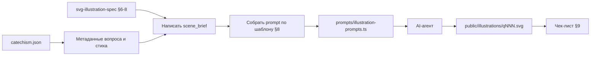

# Требования к TypeScript-файлу промптов для SVG-иллюстраций

Формальный контракт будущего файла `prompts/illustration-prompts.ts`: типизированный массив из **114** промптов для генерации `public/illustrations/qNNN.svg`.

**Статус:** реализовано и принято (см. §8).

Опора:

- Шаблон промпта и правила сцен — [`specs/svg-illustration-spec.md`](../specs/svg-illustration-spec.md) (§6–§9)
- Данные карточек — [`data/catechism.json`](../data/catechism.json)
- Хелперы стихов — [`utils/catechism.ts`](../utils/catechism.ts) (`versesForQuestion`, `getQuestionWithVerses`)

---

## 1. Назначение

| Роль | Описание |
|------|----------|
| Вход для AI-агента | Готовый текст `prompt` на каждый вопрос |
| Трассировка | Метаданные (`question_number`, тексты, стих) рядом с промптом |
| Контроль качества сцены | Обязательный `scene_brief` с учётом доктринальных ограничений |
| Не является | Хранилищем SVG, растра или полем `illustration` в JSON |

Пути в JSON уже заданы (`illustrations/q001.svg` …). Файл промптов **не** изменяет `catechism.json`.

---

## 2. Расположение и зависимости

**Путь:** `prompts/illustration-prompts.ts`

**Разрешено:**

- Импорт типов/хелперов из `utils/catechism.ts` в *скрипте сборки* промптов (если промпты генерируются кодом).
- Самодостаточный закоммиченный массив: агент читает файл без Node/fs и без доступа к диску иллюстраций.

**Запрещено:**

- `import … from 'node:fs'` / любой I/O в самом `illustration-prompts.ts`.
- Встраивание SVG-разметки в поля записи.
- Дублирование полной svg-спеки внутри файла — ссылка на `specs/svg-illustration-spec.md` в комментарии шапки достаточна.

---

## 3. Тип записи

```ts
/**
 * Одна запись = один вопрос = один целевой файл public/illustrations/qNNN.svg.
 * Промпт строится по шаблону specs/svg-illustration-spec.md §8.
 */
export interface IllustrationPromptEntry {
  /** Номер вопроса по книге, 1…114, уникальный в массиве. */
  question_number: number;

  /** Раздел катехизиса (topics.topic_id). */
  topic_id: number;

  /** Текст вопроса из catechism.json (для трассировки и подстановки в промпт). */
  question_content: string;

  /** Текст ответа из catechism.json. */
  answer: string;

  /**
   * reference первого связанного стиха (минимальный position),
   * либо null если у вопроса нет стихов.
   */
  verse_reference: string | null;

  /**
   * text первого связанного стиха, либо null
   * (нет стихов или text === null в JSON).
   */
  verse_text: string | null;

  /**
   * Короткая подсказка сцены (1–2 предложения) для плейсхолдера {{scene_brief}}.
   * Обязательна для всех 114 записей. Для чувствительных вопросов — по §7 svg-спеки.
   */
  scene_brief: string;

  /**
   * Полный текст промпта для AI-агента (шаблон §8 с подстановками).
   * Должен содержать жёсткие правила, стиль, технику и блок КАРТОЧКА.
   */
  prompt: string;
}

/** Ровно 114 записей, question_number = 1…114 без пропусков и дублей. */
export const illustrationPrompts: IllustrationPromptEntry[];
```

---

## 4. Обязательные экспорты-хелперы

```ts
/** Запись по номеру вопроса или undefined. */
export function getPromptByQuestionNumber(
  questionNumber: number,
): IllustrationPromptEntry | undefined;

/**
 * Номера вопросов, у которых scene_brief пустой / из одних пробелов.
 * Для валидации перед генерацией; в готовом файле должен возвращать [].
 */
export function promptsMissingSceneBrief(): number[];

/**
 * Номера 1…114, отсутствующие в массиве (дыры).
 * В готовом файле должен возвращать [].
 */
export function promptsMissingNumbers(): number[];
```

Реализация `promptsMissingNumbers` — сверка множества `question_number` с диапазоном 1…114.

Опционально (рекомендуется):

```ts
/** Константа длины для тестов/ассертов. */
export const ILLUSTRATION_PROMPT_COUNT = 114;
```

---

## 5. Правила наполнения полей

### 5.1. Источник метаданных

| Поле | Источник |
|------|----------|
| `question_number`, `topic_id`, `question_content`, `answer` | `questions[]` |
| `verse_reference`, `verse_text` | Первый стих из `versesForQuestion(n)` (min `position`). Нет стихов → оба `null`. Есть стих с `text: null` → `verse_reference` заполнен, `verse_text = null` |
| `scene_brief` | Авторская/агентная подсказка сцены (§6–§7 svg-спеки), не копипаст ответа |
| `prompt` | Шаблон §8 + подстановки |

### 5.2. Сборка `prompt`

1. Взять шаблон из [`specs/svg-illustration-spec.md`](../specs/svg-illustration-spec.md) §8 «Промпт для AI-агента».
2. Подставить:
   - `{{question_number}}`
   - `{{question_content}}`
   - `{{answer}}`
   - `{{scene_brief}}`
3. Блок «Стих: {{verse_reference}} — {{verse_text}}»:
   - если `verse_reference === null` — **опустить** строку целиком;
   - если `verse_text === null` при непустом reference — указать только ссылку, без текста цитаты (напр. `Стих: {reference}`).
4. «Шапка» жёстких правил и палитры — неизменна для всех 114 записей.
5. В `prompt` не должно остаться нераскрытых `{{…}}`.

### 5.3. Требования к `scene_brief`

- Длина: ориентир 40–200 символов, 1–2 предложения на русском.
- Конкретная, буквальная, спокойная сцена для ребёнка 6–8 лет.
- Приоритет визуальных решений — §6 svg-спеки (творение → ребёнок → символ → библейская сцена без Божества).
- Для вопросов из таблицы §7 — явная безопасная формулировка (что показать / чего избегать можно кратко внутри brief).

Примеры формулировок (не нормативные тексты для продакшена):

| № | Тема | Пример `scene_brief` |
|---|------|----------------------|
| 1 | Сотворение | Мальчик на холме под светлым небом; мягкие лучи — намёк на Творца без фигуры Бога. |
| 69 | 2-я заповедь | Каменные скрижали на фоне горы; без изображения Бога. |
| 111 | Ад | Закрытые тёмные ворота и светлая тропа в сторону — без огня и людей в мучениях. |

### 5.4. Инварианты массива

- `illustrationPrompts.length === 114`
- Множество `question_number` = `{1, 2, …, 114}`
- Каждый `scene_brief.trim().length > 0`
- Каждый `prompt.trim().length > 0` и содержит маркеры правил (напр. «НЕ изображай Бога» / viewBox `0 0 1200 900`) — рекомендуется smoke-тест
- Порядок записей: предпочтительно по возрастанию `question_number` (1…114)

---

## 6. Workflow создания и использования



### Шаги

1. **Каркас** — типы, пустой/черновой массив или генератор из JSON с заглушками `scene_brief` (`TODO`).
2. **Наполнение `scene_brief`** — вручную или агентом с ревью по §2 / §7 svg-спеки.
3. **Сборка `prompt`** — функция `buildPrompt(entryWithoutPrompt)` или одноразовый скрипт; результат закоммитить в массив (самодостаточность).
4. **Валидация** — `promptsMissingSceneBrief()` и `promptsMissingNumbers()` возвращают `[]`.
5. **Генерация SVG** — агент берёт `getPromptByQuestionNumber(n).prompt`, пишет только валидный SVG в `public/illustrations/qNNN.svg`.
6. **Приёмка** — чек-лист §9; прототип показывает картинку вместо placeholder ([`static-prototype-spec.md`](static-prototype-spec.md) §8).

Пакетная генерация: рекомендуется батчами (напр. по разделу / по 10 номеров) с ручной выборочной проверкой чувствительных вопросов (§7).

---

## 7. Что не входит в файл промптов

- Содержимое SVG / PNG / JPG / WebP
- Изменение `questions[].illustration` в JSON
- Санитизация SVG (`sanitizeSvg` — зона `images/illustrations.node.ts`)
- UI статического прототипа
- Промпты для растра (этот контракт — под SVG-шаблон §8; растр при необходимости — отдельный процесс по README)

---

## 8. Критерии приёмки файла

- [x] Файл существует по пути `prompts/illustration-prompts.ts`.
- [x] Экспортированы `IllustrationPromptEntry`, `illustrationPrompts`, `getPromptByQuestionNumber`, `promptsMissingSceneBrief`, `promptsMissingNumbers`.
- [x] 114 записей, номера 1…114 без пропусков.
- [x] Все `scene_brief` непустые; чувствительные вопросы согласованы с §7.
- [x] Все `prompt` собраны по §8, без оставшихся `{{…}}`; блок стиха опущен при отсутствии стихов.
- [x] Нет Node/fs-импортов; нет встроенной SVG-разметки в полях.
- [x] Комментарий в шапке файла ссылается на `specs/svg-illustration-spec.md`.

---

## 9. Шаблон шапки будущего файла

```ts
/**
 * Промпты для генерации SVG-иллюстраций катехизиса (q001…q114).
 *
 * Правила стиля, доктрины и шаблон промпта:
 *   specs/svg-illustration-spec.md
 * Контракт этого модуля:
 *   docs/svg-prompts-ts-spec.md
 *
 * Целевой вывод агента: public/illustrations/qNNN.svg
 * (поле questions[].illustration в JSON уже содержит путь).
 */

import type { /* при необходимости */ } from '../utils/catechism';

export interface IllustrationPromptEntry { /* … */ }

export const ILLUSTRATION_PROMPT_COUNT = 114;

export const illustrationPrompts: IllustrationPromptEntry[] = [
  // … 114 записей
];

export function getPromptByQuestionNumber(/* … */) { /* … */ }
export function promptsMissingSceneBrief() { /* … */ }
export function promptsMissingNumbers() { /* … */ }
```
